# TP Initiation GIT

Bienvenu·e sur Github !

Je vous fais vite fait un petit récap de ce qu'est **Git** :
> Git est un outil pour versionner vos projets. Vous envoyez votre projet dans un **repository** (similaire à des dossiers) sur des platformes telles que Github, Gitlab ou *Gitea* dans le cas d'YNOV. Ainsi vous pouvez partager ou encore travailler à plusieurs sur vos projets.

Dans ce TP, vous appliquerez les notions vues précédemment. Ainsi vous comprendrez un peu mieux le fonctionnement des commandes.

Le TP se fera en 2 parties. Dans la première, vous manipulerez sur un repository seul pour que vous vous familiarisez avec l'outil. Dans la seconde partie, vous serez en groupe sur un seul repository.

---
## Sommaire

- [TP Initiation GIT](#tp-initiation-git)
	- [Sommaire](#sommaire)
- [Installation](#installation)
	- [Windows](#windows)
	- [Mac](#mac)
	- [Linux](#linux)
- [Partie 1 - Familiarisation](#partie-1---familiarisation)
	- [Objectif](#objectif)
	- [Création de votre repository](#création-de-votre-repository)
	- [Manipulation](#manipulation)
- [Partie 2 - Travailler en groupe](#partie-2---travailler-en-groupe)
	- [Objectif](#objectif-1)
	- [Repository du groupe](#repository-du-groupe)
	- [Manipulation](#manipulation-1)

# Installation

Avant de commencer, il faut s'assurer que vous avez l'outil sur votre machine.

Pour cela, ouvrez un terminal.
> Sous **Windows**, cherchez `cmd` dans la recherche de la barre des tâches.\
> Sous **Mac**, faites le raccourci `Command + Barre d'espace` et tappez `Terminal`.\
> Sous **Linux**, cherchez dans vos applications `Terminal`.

Pour vérifier que vous avez Git, faites la commande suivante :
```shell
> git --version
```
Si vous avez une erreur, alors il faudra l'installer.
## Windows
Pour windows, téléchargez l'installeur via [cette page](https://git-scm.com/download/win).

Pas besoin de modifier les paramètres d'installation, laissez par défaut.

## Mac
Toutes les informations se situent sur [cette page](https://git-scm.com/download/mac).

## Linux
Les informations sont sur [cette page](https://git-scm.com/download/linux). Prenez bien la commande en fonction de votre distribution.

# Partie 1 - Familiarisation
## Objectif
L'objectif de cette partie est de vous familiariser avec l'outil **Git** afin de comprendre son fonctionnement et de pouvoir l'utiliser dans des projets de groupe.

## Création de votre repository

> On utilisera le mot `repo` pour dire `repository`.

Sur [Gitea](https://git.ytrack.learn.ynov.com/), vous pouvez créer un nouveau repository avec le bouton suivant :


Appelez votre repo **tp-git-initiation**
> Pas besoin de modifier les autres options, donnez lui juste un nom.

Une fois créé, nous pouvons commencer le TP.

## Manipulation
> En cas de souci, une doc récapitulative se situe [ici](./doc/).\
> À chaque étape, vérifiez votre repo sur Gitea pour confirmer les modifications.
1. Clonez votre repository.
	- Sur votre terminal, entrez la commande `git clone url`.
		- Pour ouvrir le terminal, regardez la partie [Installation](#installation). Une explication rapide s'y trouve.
		- Vous trouverez les explications de la commande dans la [documentation](./doc/).
		- Vous trouverez l'url ici :

		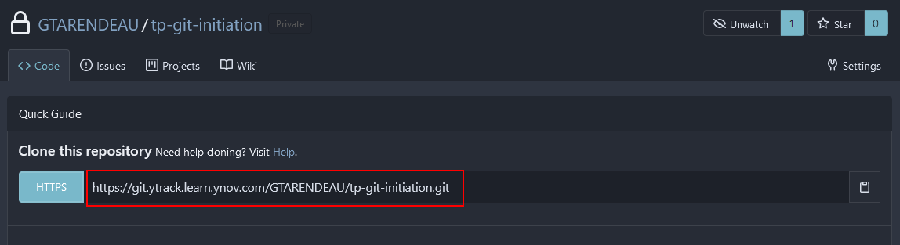
    - Un dossier a dû être créé à l'endroit où vous avez cloné votre repo.
		- Ouvrez ce dossier avec **Visual Studio Code** (plus couramment `VScode`).
		- Vous pouvez télécharger VScode ici : [](https://code.visualstudio.com/download)
	- Toutes les étapes qui vont suivre se feront sur **VScode**.
		- Vous pouvez ouvrir un terminal dans le menu en haut de VScode :

		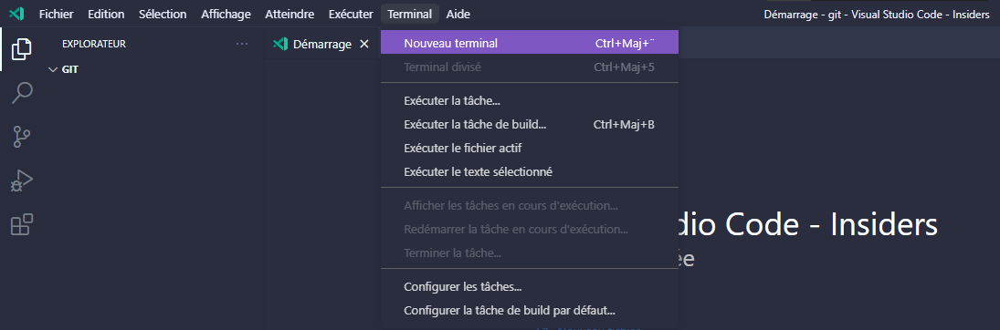

	> ⚠ Si vous êtes sur **Mac**, vous devez créer un fichier `.gitignore` et écrire dans ce fichier : `.DS_Store`. N'oubliez pas de l'enregistrer.\
	> Une fois cela effectué, il faudra l'ajouter à votre repo pendant l'étape 3.
2. Créez un fichier au nom de `hello.txt` dans le dossier du repository sur votre pc.
	- Sur **VScode**,  vous pouvez créer un fichier ici :

	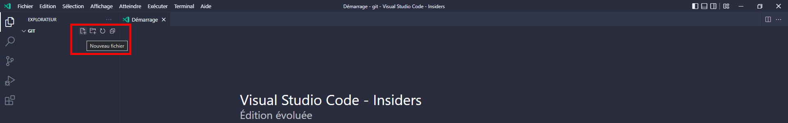
	- Dans ce fichier écrivez `Hello World!` et enregistrez le.
	- Effectuez un `git status` pour voir les changements qui ont été effectués en local.
		- Un joli texte rouge écrit `hello.txt` devrait s'afficher.
3. Ajoutez ce fichier à votre repo (il doit apparaître sur le repo Gitea 👀).
	- Vous devez vous servir de la [doc](./doc/).
		- Il s'agit des commandes de bases (`git add`, `git commit`, `git push`)
			> ⚠ Pour les utilisteurs sur **Mac** n'oubliez pas d'ajouter le fichier `.gitignore` !
			- Ces commandes doivent être utilisées pour envoyer des nouveaux fichiers ou des modifications des fichiers déjà existants.
			- Pour la commande `git commit`, le message doit contenir les modifications effectuées. Dans notre cas, le message sera `Adding hello.txt`.
		- En exécutant `git commit`, vous aurez certainement une erreur. Allez dans la [documentation](./doc/) pour régler ce problème.
	- Pour s'assurer que tout est bon, faites un `git status`.
4. Recréez un autre fichier que vous appelerez `world.txt` et ajoutez le à votre repo.
5. Maintenant, il faut **revert** votre commit.
    - L'objectif est de revenir un pas en arrière, donc l'étape 4 sera annulée.
	- Si vous avez regardez la doc, la commande adapté demande un `hash`
		- Vous trouverez ce hash sur la page **Gitea du repo** à cet endroit :

		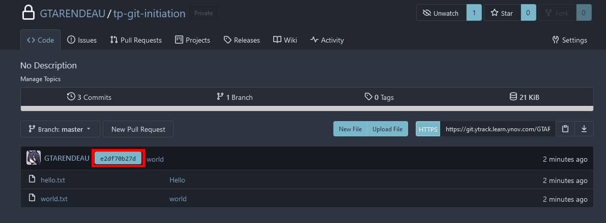
		- Sinon, vous pouvez cliquer sur `Commits` pour lister vos commits avec les hash de chacun.
		- Quand vous allez exécuter la commande, vous aurez ceci :

		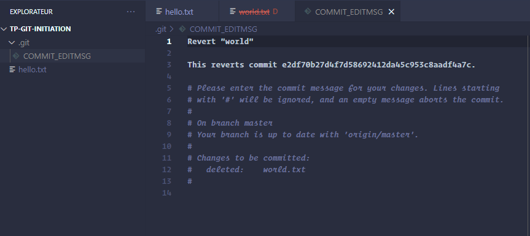
		- Pas de panique ! Vous pouvez juste fermer cette page et le commit se fera tout seul.
		- Il ne vous restera plus qu'à push !
    - Vous devez avoir à ce point, seulement le fichier `hello.txt` de l'étape 3 dans votre repo.
6. Créez un fichier qui aura pour nom `rouge.exe`
> ⚠ Le nom est important !
7. Ajoutez le à votre repo.
	- Les commandes classiques (`git add`, `git commit`, `git push`).
	- Normalement, vous ne pourrez pas push, vous aurez un joli texte rouge écrit :
	```
	 ! [remote rejected] master -> master (pre-receive hook declined)
	error: failed to push some refs to 'https://git.ytrack.learn.ynov.com/NOMUTILISATEUR/tp-git-initiation.git'
	```
	- Cette erreur est due au fait que la plateforme n'accepte pas les fichiers `.exe` (les fichiers exécutables)
8. Corrigeons cette erreur ! Utilisons le **reset**.
	- Comme nous n'avons pas pu effectuer l'envoi de notre fichier au repo, nous devons annuler notre commit en cours.
		- Vous pouvez voir que le commit est en attente de push avec un `git status`.
	- Servez-vous de la [documentation](./doc/).
		- Nous voulons **revenir seulement d'un commit en arrière**, **garder les modifications en local** et **les retirer de la snapshot**.
	- Une fois la commande effectuée, la commande `git status` devrait vous renvoyer ce message :

	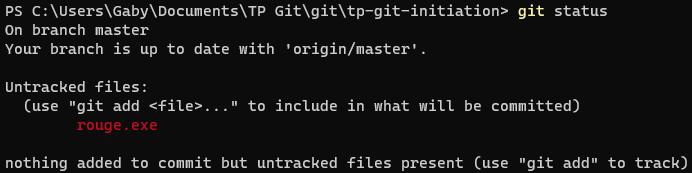
9. Finissons-en avec ce `rouge.exe` ! Ignorons-le du repo.
	- Pour ignorer un fichier, les utilisateurs **Mac** l'ont déjà fait depuis le départ.
	- Vous devez créer un fichier `.gitignore` s'il n'existe pas. Ce fichier aura une liste de fichiers / documents à ne pas envoyer vers votre repo.
	- Dans ce fichier, écrivez `rouge.exe` et enregistrez-le.
		> Pour ceux qui sont sur **Mac**, ajoutez une ligne et écrivez `rouge.exe`.
	- Ajoutez ce fichier à votre repo.
		> ⚠ Utilisez `git add .` ! Vous verrez l'utilité du `.gitignore` ainsi.
	- Si tout marche bien, vous devriez pouvoir push, et dans votre repo, vous ne devriez pas avoir le fichier `rouge.exe`.
10. Créez une branche `tomate` et sélectionnez la.
	- Aidez-vous de la [documentation](./doc/) pour ça.
	- Pour vous assurer que vous avez bien sélectionné la branche, effectuez la commande `git status`. Vous devriez avoir ce résultat :

	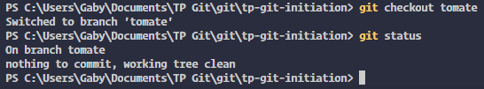
11. Modifiez le fichier `hello.txt`.
	- Changez le texte par `Good bye World!` et enregistrez le fichier.
12. Créez un nouveau fichier qui aura pour nom `feuille.txt`.
13. Faites un commit avec ces modifications.
	- Pour aller plus vite, vous pouvez faire un `git add .`
		- Cette commande ajoutera toutes les modifications qui ont été effectuées en local.
		- Le `git add` ne sert pas uniquement à ajouter un nouveau fichier, mais aussi à ajouter les modifications des fichiers déjà existants.
	- Comme pour l'ajout de `hello.txt`, 
	- Vous pouvez avoir l'erreur suivante :

	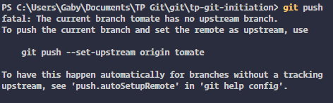
	- Pour corriger cette erreur, faites la commande suivante :
	```shell
	> git push --set-upstream origin tomate
	```
14. Sélectionnez sur la branche **master**.
15. Faites une modification sur le fichier `hello.txt`.
	- Remplacez le texte par `Say Hello World!` et enregistrez le fichier.
16. Faites un commit avec vos modifications.
17. Effectuez un merge avec la branche `tomate`.
	- À cette étape, vous êtes normalement sur la branche **master**.
		- Faites une vérification avec la commande `git status`.
	- Pour fusionner la branche **tomate** avec la branche **master**, faites la commande de merge trouvable dans la [documentation](./doc/).
18. Oups ! Vous avez un conflit ( ͡° ͜ʖ ͡°) . On va régler ça !
	- Dans votre fichier `hello.txt` vous devriez avoir ce texte :
	```
	<<<<<<< HEAD
	Say Hello World!
	=======
	Good bye World!
	>>>>>>> tomate
	```
	- L'erreur qu'il y a est un **conflit**. **Git** a donc remplacé la ligne contenant le conflit par ce texte.
	- Le conflit est représenté en 2 parties séparées par des "=".
		- Sur la partie supérieure représentée par `<<<<<<< HEAD`, il s'agit de la modification qu'il y a sur la branche actuelle, soit la branche **master**.
		- Sur la partie inférieure représentée par `>>>>>>> tomate`, il s'agit de la modification qu'il y a sur la branche avec laquelle vous voulez effectuer votre merge.
	- Pour corriger ce conflit, il vous suffit de retirer les parties non désirées.
		- Dans notre cas, on va garder notre `Good bye World!`
			- Modifiez à la main le fichier pour garder uniquement ce texte. Pensez à enregistrer le fichier.
	- Une fois cela effectué, vous pouvez faire un commit (`git add`, `git commit`, `git push`).
		- Pensez à expliquer dans le message de votre commit, les modifications effectuées d'une manière très condensée.

Bien, maintenant que vous avez fait cette première partie en étant seul, vous allez vous mettre un peu plus dans la plus grande utilisation de Git : un travail de groupe.

# Partie 2 - Travailler en groupe
## Objectif
Dans cette deuxième partie, vous allez devoir utiliser Git en groupe. Ainsi, vous verrez l'utilisation au sein d'une équipe.
> Il s'agira d'un petit projet, mais imaginez son utilisation à plus grande échelle.

Mettez vous en groupe de **4 à 6 personnes**.

## Repository du groupe
Toujours sur **Gitea**, un membre du groupe doit créer un repo (et uniquement un seul membre). Vous pouvez returner à la partie [Création de votre repository](#création-de-votre-repository) si besoin.

Le repo aura pour nom **tp-git-initiation-groupe**
> Pour ceux qui ne font pas le repo, suivez quand même cette partie.

Une fois le repo de créé, vous aurez un bouton qui permettra d'accéder aux paramètres du repo en haut à droite :

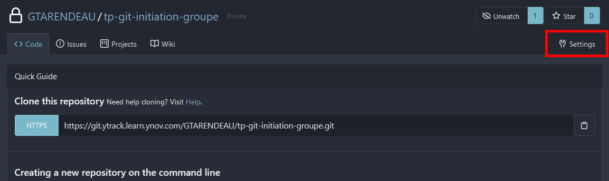

Dans les paramètres, un onglet **Collaborators** permet de gérer les collaborateurs de votre repo :

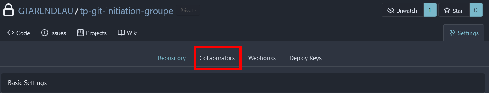

Ajoutez les autres membres du groupe et mettez-les en **Write**.
> `Read` : Peut seulement voir le repo, ne peut pas agir dessus.\
> `Write` : Peut lire et modifier le repo.\
> `Administrator` : Peut lire, modifier et changer la configuration du repo.

Vous devriez avoir quelque chose de similaire à ceci :

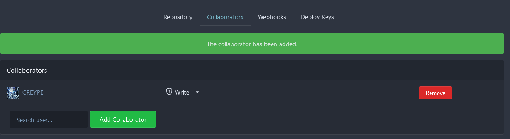

## Manipulation

Pour cette partie du TP, vous serez en autonomie.

Voici les étapes de votre TP :
1. Le repo doit contenir 1 dossier par membre du groupe.
	- Chacun doit s'occuper de son dossier.
	- Le dossier doit s'appeler `NOM Prénom`.
	> Mettez votre nom et votre prénom, pas NOM Prénom, sinon vous allez perdre des points 👀
2. Dans chaque dossier, il y aura 2 autres dossiers.
	- Un dossier `privé` qui devra être ignoré par le biais d'un `.gitignore`.
	- Un dossier `publique` qui lui sera dans le repo.
3. Mettez des fichiers dans vos dossiers.
	- Un fichier `loutre.txt` doit être dans votre dossier `privé`.
	- Un fichier `belette.txt` doit être dans votre dossier `publique`.
4. Tout doit apparaître dans le repo, sauf les dossiers `privé` de chaque membre.
> En bonus : Essayez de faire le moins de commit possible sur la branche `master`.\
> L'objectif du bonus : Le nombre de membres de votre groupe + 1 = nombre de commits

<details>
<summary style="cursor: pointer; font-weight: bold;">La suite une fois que vous aurez fini les étapes du dessus.</summary>
<br />

Une fois que vous avez fini, amusez vous avec cette commande `git log --oneline --graph`.

> Il n'y a pas de suite, je rigolais 👀
<details>
<summary style="cursor: pointer; font-weight: bold;">Vous avez votre récompense.</summary>


> Et d'ailleurs, ce n'est pas noté ;)
</details>
</details>